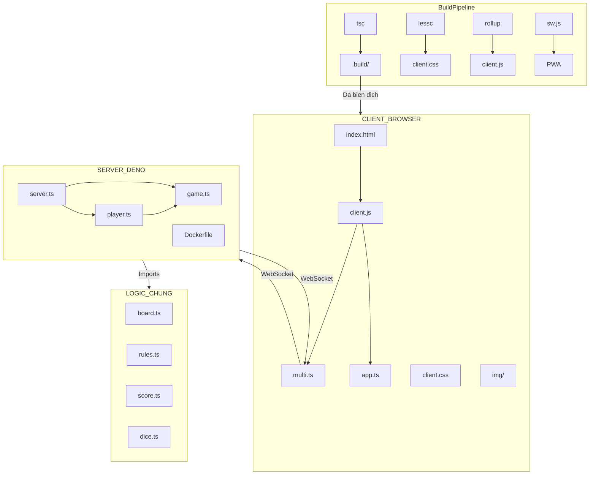

## 1. Hạ Tầng Chi Tiết

### 1.1 Bản Đồ Module & Trách Nhiệm

#### Backend Module — Chi Tiết

| Module | Sở hữu | KHÔNG sở hữu |
|---|---|---|
| `server.ts` | HTTP listener, WS handshake, room registry `Map<roomId, Room>` | Business logic, trạng thái người chơi, tính điểm |
| `game.ts` |Room FSM, bộ đếm thời gian pha, vòng lặp broadcast, bộ đếm ngày | Tài nguyên người chơi riêng lẻ, thay đổi lưới, tính toán VP |
| `player.ts` | Gửi RPC theo socket, trạng thái Xu/Stamina/Debt, bitmask khóa stamina | Sự kiện cấp phòng, trạng thái lưới, tính điểm |

