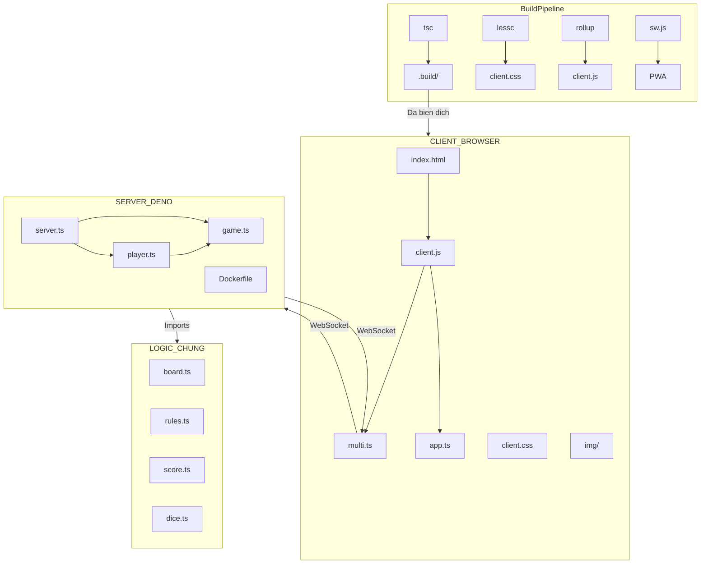

## 1. Hạ Tầng Chi Tiết

### 1.1 Bản Đồ Module & Trách Nhiệm

#### Trách Nhiệm Module — Chi Tiết

| Module | Loại | Sở hữu | KHÔNG sở hữu |
|---|---|---|---|
| `server.ts` | **Điểm khởi đầu** | HTTP listener, WS handshake, room registry `Map<roomId, Room>` | Business logic, trạng thái người chơi, tính điểm |
| `game.ts` | **Điều phối viên** | Room FSM, bộ đếm thời gian pha, vòng lặp broadcast, bộ đếm ngày | Tài nguyên người chơi riêng lẻ, thay đổi lưới, tính toán VP |
| `player.ts` | **Trình xử lý phiên** | Gửi RPC theo socket, trạng thái Xu/Stamina/Debt, bitmask khóa stamina | Sự kiện cấp phòng, trạng thái lưới, tính điểm |
| `board.ts` | **Cấu trúc dữ liệu** | Lưới 3×5 (3 ngày × 5 khung giờ), đặt/xóa ô, áp dụng ràng buộc slot bị khóa | Lý do ô không hợp lệ (uỷ quyền cho `rules.ts`) |
| `rules.ts` | **Bộ kiểm tra thuần** | Bảng tương thích tag–slot, đường cong phạt khoảng cách, logic ràng buộc debt/stamina | Thay đổi trạng thái dưới mọi hình thức |
| `score.ts` | **Máy tính** | Đọc VP cơ bản, áp dụng hệ số nhân combo, trừ điểm phạt, tổng điểm pha, tổng cuối | Đọc trạng thái người chơi trực tiếp (nhận qua tham số) |
| `dice.ts` | **Ngẫu nhiên** | Mulberry32 PRNG, vòng đời seed theo pha, bảng xác suất sự kiện theo tag | Áp dụng hiệu ứng sự kiện (trả về `EventEffect`, `game.ts` áp dụng) |
| `tile.ts` | **Enum / cấu hình** | Enum `TileType`, `TagSet`, `GameType`, giá trị VP cơ bản, metadata ô | Trạng thái runtime |

---

## 2. Ràng Buộc Backend Chính

Các ràng buộc này xuất phát trực tiếp từ tài liệu logic trò chơi và phải được thực thi phía server mọi lúc.

| Ràng buộc | Thực thi tại | Quy tắc |
|---|---|---|
| **Giới hạn tài nguyên** | `player.ts` | Xu ≤ 15 token; Stamina ≤ 20. Bất kỳ hành động nào vượt quá giới hạn phải bị chặn trước khi `game.ts` xử lý. |
| **Phạt Debt** | `score.ts` | Mỗi Debt Token chưa giải quyết khi kết thúc Pha = −50 VP. Áp dụng sau khi `game.ts` chuyển sang trạng thái `SCORING`. |
| **Khóa Stamina** | `board.ts` + `player.ts` | Mượn stamina sẽ khóa 1–2 slot đầu tiên của ngày tiếp theo. Lưu dưới dạng bitmask slot bị khóa; `board.ts` từ chối đặt ô lên slot bị khóa. |
| **Phạt khoảng cách — liền kề** | `rules.ts` | Ô có khoảng cách = 0 (ví dụ: Sáng → Trưa): ngưỡng 10 km. Phạt tăng dần trên ngưỡng. |
| **Phạt khoảng cách — có khoảng trống** | `rules.ts` | Một slot trống giữa các ô (khoảng cách = 1, ví dụ: Sáng → Chiều): ngưỡng nới lỏng thành 30 km. |
| **Sự kiện theo tag** | `dice.ts` | Mưa Giông chỉ kích hoạt trên ô có tag Ngoài Trời; Kẹt Xe trên tag Thành Phố; Chặt Chém trên Ẩm Thực/Chợ; Flash Sale là phổ quát. |
| **Phân nhánh bản đồ pha** | `game.ts` | Pha 2A (Đà Nẵng) tốn Xu; Pha 2B (Đà Lạt) tốn 5 Xu + 10 Stamina. `game.ts` kiểm tra tài nguyên trước khi xác nhận nhánh. |
| **Kích thước lưới** | `board.ts` | Bảng là chính xác 3 ngày × 5 khung giờ. Không ô nào được đặt ngoài ranh giới này. |
| **Quyền hạn PRNG** | `dice.ts` + `game.ts` | Kết quả PRNG từ server là chuẩn quyền. Kết quả sự kiện do client báo cáo bị bỏ qua. Seed được phát sóng trước khi mô phỏng bắt đầu. |
| **Trình tự pha** | FSM `game.ts` | Chuyển đổi trái phép (ví dụ: đặt ô trong SCORING) bị từ chối. `player.ts` và `score.ts` phải kiểm tra pha hiện tại trước khi thực thi bất kỳ logic nào. |
