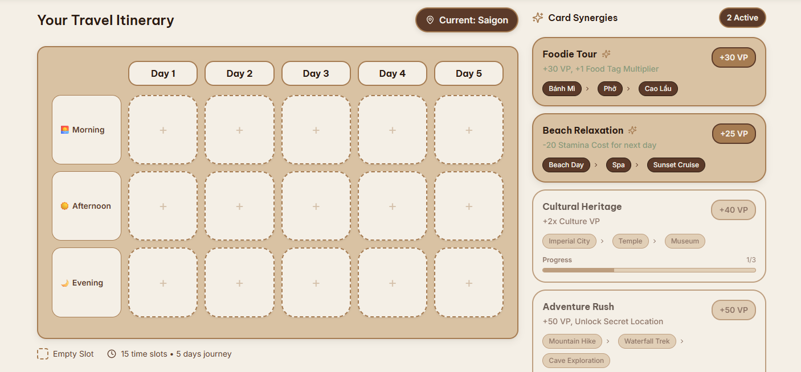
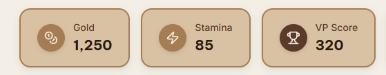
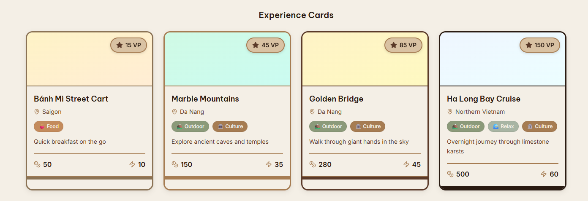
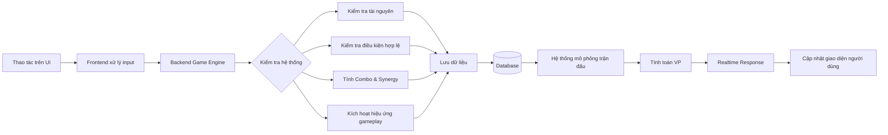

# User Experience & Data Flow 
---
## Theme và định hướng thiết kế giao diện
Hệ thống sử dụng phong cách thiết kế hiện đại mang tone màu earthy kết hợp giữa trải nghiệm du lịch và board game chiến thuật nhằm tạo cảm giác khám phá, lên kế hoạch và quản lý hành trình

**Bảng màu chính gồm:**
- Dark Brown `#2A1B12`
- Coffee Brown `#5B3A29`
- Warm Sand `#A67C52`
- Light Beige `#D9C2A3`
- Soft White `#F4EFE6`

Theme này được lựa chọn vì phù hợp với cơ chế gameplay của hệ thống. Trò chơi không mang phong cách hành động hoặc fantasy mà tập trung vào cảm giác lên kế hoạch du lịch thực tế, quản lý tài nguyên, xây dựng lịch trình, và tối ưu trải nghiệm khám phá.

Tone màu nâu – beige giúp giao diện: tạo cảm giác giống bản đồ du lịch, nhật ký hành trình và vé du lịch, mang tính thư giãn và gần gũi, đồng thời vẫn giữ được vẻ hiện đại và cao cấp.

Ngoài ra, phong cách thiết kế **card-based** được sử dụng xuyên suốt hệ thống nhằm đồng bộ với gameplay sử dụng Thẻ Địa Điểm và Bàn Cờ Lịch Trình. Điều này giúp người dùng dễ hình dung cơ chế trò chơi và thao tác trực quan hơn.

---
## Tổng quan trải nghiệm người dùng
Website được thiết kế như một nền tảng du lịch tương tác kết hợp game chiến thuật thẻ bài. Người dùng không chỉ tìm kiếm thông tin du lịch mà còn tham gia vào quá trình xây dựng lịch trình du lịch ảo để đạt điểm số cao nhất.

**Mục tiêu chính của người chơi là:**
- Mua và sắp xếp các Thẻ Địa Điểm
- Quản lý Xu Vàng và Thể Lực
- Tạo nhiều combo thẻ hiệu quả
- Đạt được điểm hạnh phúc (VP) cao nhất

**Luồng trải nghiệm người dùng gồm:**
1. Đăng nhập và vào game
2. Nhận thẻ và chọn chiến thuật
3. Xây dựng lịch trình trên bàn cờ
4. Quản lý tài nguyên
5. Chạy mô phỏng hành trình
6. Nhận kết quả và cập nhật tiến trình

**Thiết kế trải nghiệm tập trung vào:**
- Tư duy chiến thuật
- Tính trực quan
- Phản hồi thời gian thực

### 1. Đăng nhập và truy cập hệ thống
Khi truy cập website, người dùng sẽ nhìn thấy giao diện chính giới thiệu:
- Bản đồ du lịch
- Hệ thống thẻ
- Cơ chế gameplay
- Bảng xếp hạng VP

Người dùng có thể đăng ký tài khoản hoặc đăng nhập vào tài khoản đã có

**Dữ liệu đầu vào:**
- Email / Username
- Password

**Dữ liệu đầu ra:**
- Hồ sơ người chơi
- Lịch sử trận đấu
- Tiến trình tài khoản

### 2. Drafting Phase – Chọn thẻ chiến thuật
Khi trận đấu bắt đầu, mỗi người chơi được phát 5 Thẻ Địa Điểm ngẫu nhiên. Người chơi sẽ bí mật chọn 1 thẻ giữ lại và chuyển các thẻ còn lại cho đối thủ. Quá trình này lặp lại cho đến khi hết bài.

Đây là giai đoạn quan trọng nhất về mặt chiến thuật vì người chơi phải dự đoán hướng xây dựng lịch trình, cân bằng tài nguyên, lựa chọn combo phù hợp.

**Dữ liệu đầu vào:**
- Thẻ được phát
- Lựa chọn giữ thẻ của người chơi

**Dữ liệu đầu ra:**
- Bộ thẻ cuối cùng của người chơi
- Dữ liệu chiến thuật cho phase tiếp theo

**Về UX dự kiến sử dụng:**
- Hiệu ứng flip card
- Hover animation
- Highlight màu để giúp người dùng dễ phân biệt loại thẻ.

### 3. Xây dựng lịch trình trên bàn cờ
Sau khi draft bài, người chơi sẽ bước vào giai đoạn lắp ghép lịch trình. Mỗi người chơi có một bàn cờ dạng lưới 3x5:
- 3 hàng đại diện cho 3 ngày
- 5 cột đại diện cho các mốc thời gian trong ngày
Các ô thời gian gồm: Sáng sớm-  Trưa - Chiều - Tối - Khuya

Người chơi sẽ kéo thả các thẻ vào từng ô để tạo thành lịch trình hợp lý.

**Dữ liệu đầu vào:**
- Thẻ được chọn
- Vị trí đặt thẻ
- Thao tác kéo thả

**Dữ liệu đầu ra:**
- Lịch trình hoàn chỉnh
- Combo được kích hoạt
- Trạng thái tài nguyên cập nhật

**Thiết kế UX dự kiến sử dụng:**
- Drag-and-drop interaction
- Phản hồi khi đặt sai vị trí 
- Hiển thị combo realtime và preview điểm VP tạm thời.

### 4. Quản lý tài nguyên
Trong quá trình xây dựng lịch trình, người chơi phải quản lý:
- Xu Vàng
- Thể Lực
- Các trạng thái / sự kiện đặc biệt.

**Một số thẻ yêu cầu: tiêu hao thể lực**

Người chơi có thể: vay Xu bằng “Thẻ Tín Dụng”, hoặc “Vắt Kiệt Sức” để tiếp tục hành trình. Tuy nhiên hệ thống sẽ áp dụng hình phạt như:
- Trừ VP
- Khóa ô thời gian

**Dữ liệu đầu vào:**
- Hành động mua thẻ
- Mức tài nguyên hiện tại
- Quyết định vay tài nguyên

**Dữ liệu đầu ra:**
- Tài nguyên cập nhật
- Trạng thái phạt
- Cảnh báo hệ thống

**UX của phần này ưu tiên:**
- Preview tài nguyên realtime
- Cảnh báo phạt hoặc khi tài nguyên thấp
- Popup xác nhận trước các quyết định rủi ro

### 5. Chạy mô phỏng hành trình
Sau khi người chơi hoàn tất lịch trình, hệ thống sẽ bắt đầu chạy mô phỏng để tính điểm VP.
Quá trình mô phỏng bao gồm:
- Đọc điểm VP gốc của thẻ
- Tính khoảng cách di chuyển
- Xử lý tính hợp lý của lịch trình
- Kích hoạt sự kiện ngẫu nhiên và áp dụng hiệu ứng đặc biệt.

Ví dụ: địa điểm quá xa sẽ bị trừ điểm, thời tiết xấu làm giảm hiệu quả thẻ ngoài trời, kẹt xe khiến mất thể lực, flash sale tăng VP cho một số địa điểm.

**Dữ liệu đầu vào:**
- Lịch trình người chơi
- Tọa độ địa điểm
- Loại thẻ và tag

**Dữ liệu đầu ra:**
- Tổng điểm VP
- Hiệu ứng sự kiện
- Thống kê trận đấu

### 6. Bản đồ và hướng phát triển hành trình
Gameplay được chia thành nhiều phase du lịch:
bắt đầu từ TP.HCM, sau đó lựa chọn đi Đà Nẵng hoặc Đà Lạt và tiếp tục mở rộng sang Huế hoặc Nha Trang.

Người chơi phải quyết định đi theo hướng “Đại Gia” bằng máy bay hoặc hướng “Phượt Thủ” bằng xe máy để tiết kiệm Xu nhưng tốn Thể Lực.

**Dữ liệu đầu vào:**
- Lựa chọn tuyến đường
- Chi phí di chuyển

**Dữ liệu đầu ra:**
- Bản đồ phase tiếp theo
- Thẻ mới được mở khóa
- Chiến thuật mới

**Giao diện bản đồ sử dụng:**
- node interaction
- travel path animation
- visual route system

---
## Tổng quan luồng dữ liệu (Data Flow)
Hệ thống hoạt động theo mô hình xử lý dữ liệu tương tác liên tục giữa người chơi và game engine. Luồng dữ liệu gồm các thao tác chọn thẻ hoặc xây dựng lịch trình của người chơi

